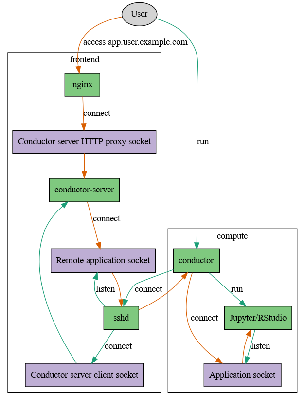

Conductor
=========

conductor provides self-service application forwarding to a public web gateway
for compute cluster users.

	Overview

The basic flow is this: The web frontend runs ``conductor-server``, which
maintains a directory of configuration files and sockets (the “forest”) that is
world-writable. The user runs ``conductor`` on a compute node, which then
connects to the web frontend server via SSH, drops a socket and configuration
file into the forest and forwards any communication to the actual application.

conductor is required, since a user must not bind his web application onto a
port on the compute machine for two reasons: a) It is usually not accessible to
him and b) other users on the same machine can access this application as well.
UNIX domain sockets respect filesystem permissions and thus prevent b). Using
SSH to forward connections is a well-established method for a) since it
integrates well with existing user authentication.

Security considerations
-----------------------

- ``conductor-server`` is exposed to the internet and supports cookie-based
  authentication
- Users must create files with very strict permissions, in particular files
  must not be world-readable or world-writable
- Due to g+s being set on the forest directory the group of created files is
  changed. Users cannot set the sticky bit on files though if they are not
  members of this group. Thus they cannot setgid executable files.
- Only the owner of a config file and socket can delete them due to o+t
- Frontend servers should limit user’s abilities to consume resources to avoid
  DoS

Usage
-----

A guix package description is provided in ``contrib/conductor.scm``, which can
be activated using:

.. code:: console

    guix package -f contrib/conductor.scm

If you’re using systemd copy the service file:

.. code:: console

    cp contrib/conductor.service /etc/systemd/system/conductor.service

Then adjust the paths, add a user and group ``conductor`` and start it with
``systemctl enable conductor && systemctl start conductor``.

Finally a user can run software using

.. code:: console

    CONDUCTOR_TOKEN=mysecuretoken conductor host:/var/forest app.socket -- my-application

